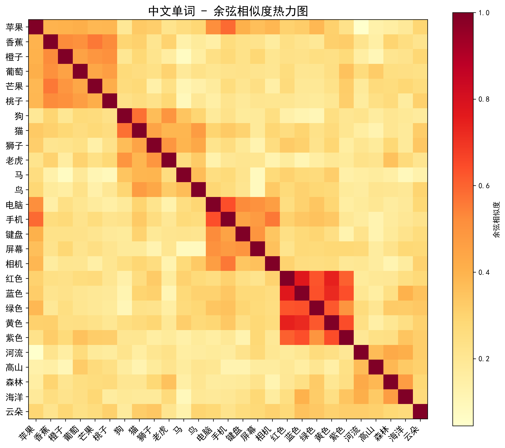
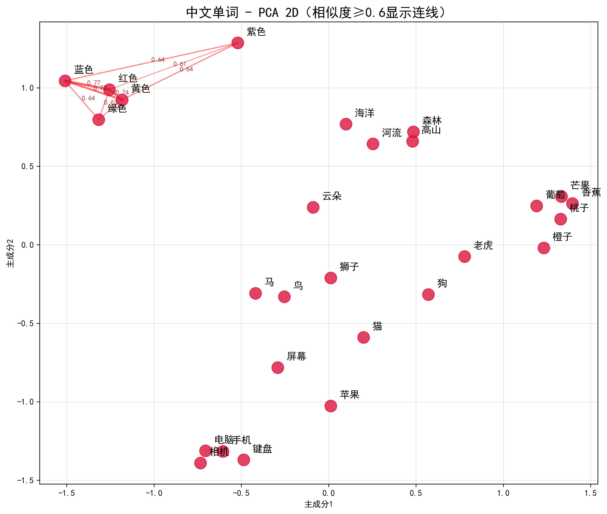
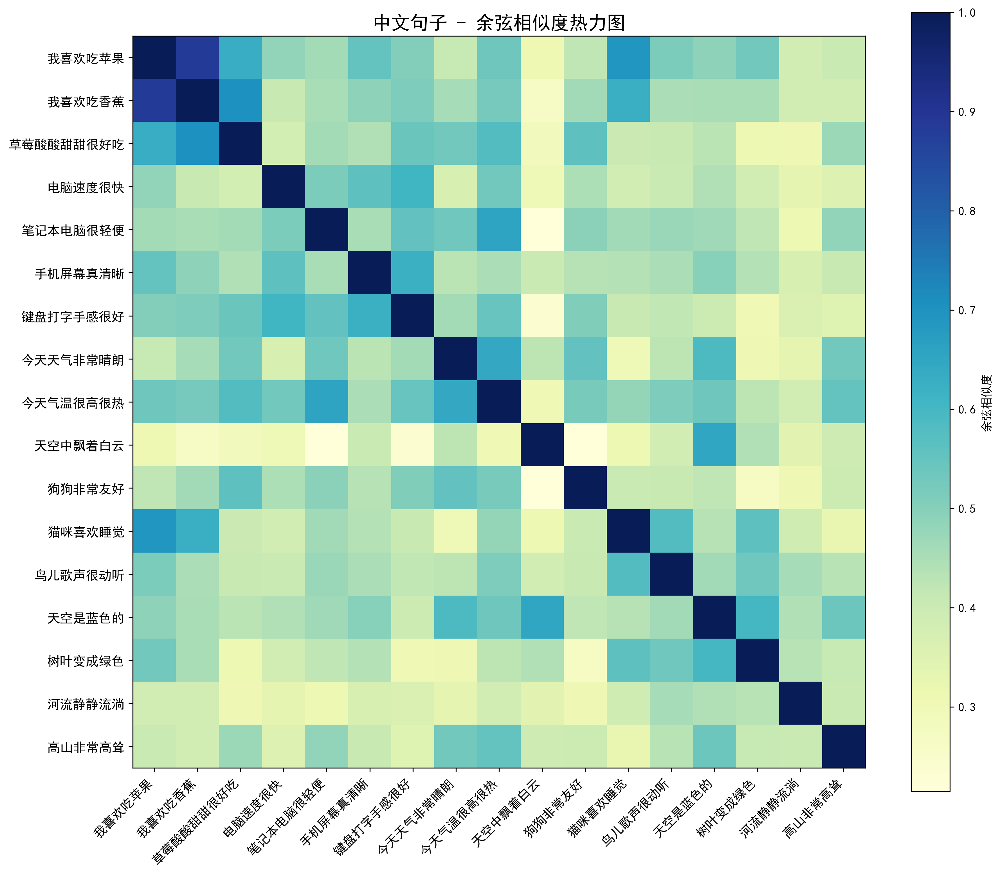
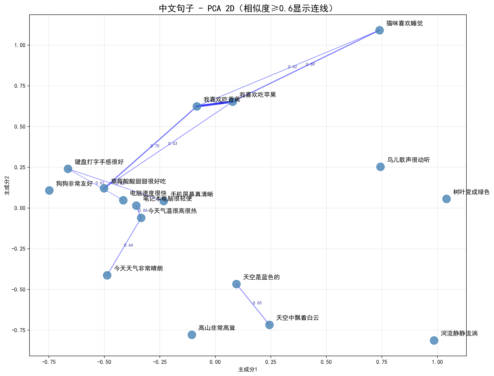
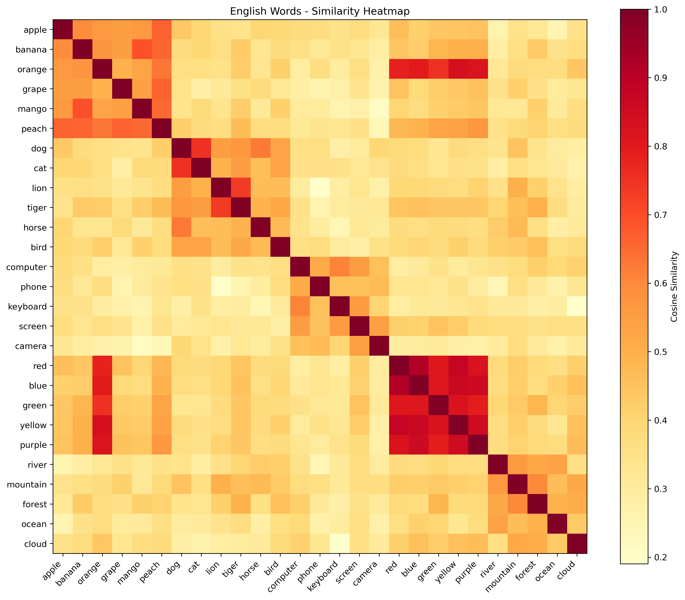
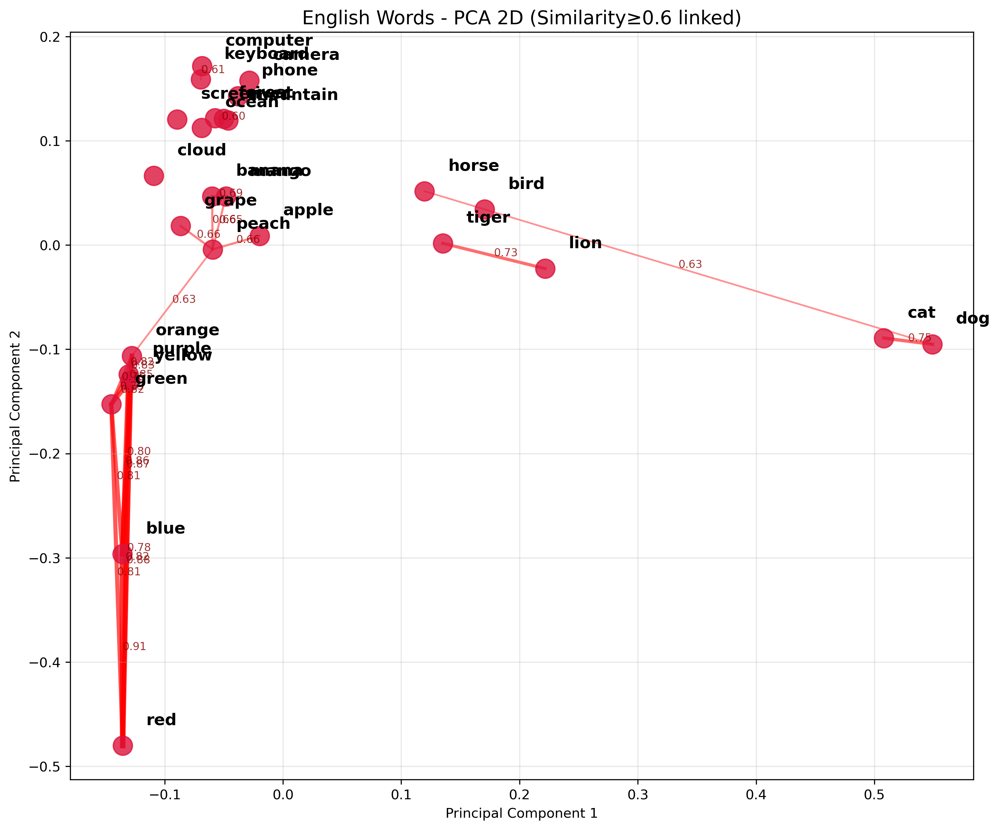
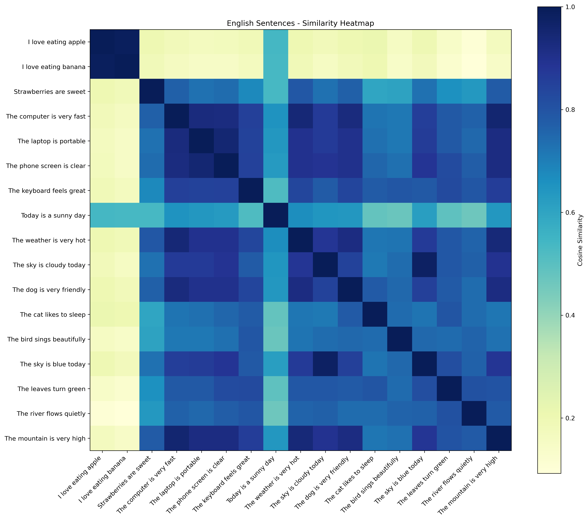
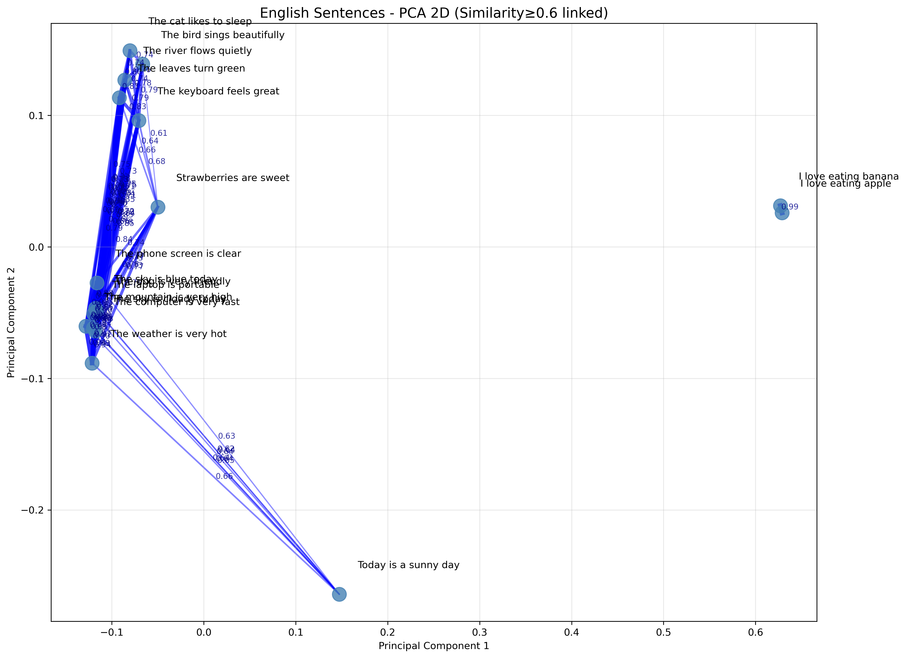

# 基于预训练词向量的中英文文本相似度比对实验报告


| 实验名称： | 基于预训练词向量的中英文文本相似度比对实验报告 |
| :--------- | ---------------------------------------------- |
| 学院名称： | 人工智能学院                                   |
| 班级：     | 人工智能231                                    |
| 学号：     | 202308064704                                   |
| 学生姓名： | 刘原野                                         |
| 指导老师： | 杨华                                           |

## 一、实验背景

词向量（Word Embedding）是自然语言处理领域的核心技术之一。它将人类语言中离散的词语，映射到一个连续的高维数值向量空间中，使得**语义相近的词在向量空间中距离更近**，语义无关的词则相距较远。

本实验使用 Meta（Facebook）AI Research 开源的 **fastText** 预训练模型，分别对中文（`cc.zh.300.bin`）和英文（`wiki-news-300d-1M-subword.vec`）的单词及句子进行向量化，再用**余弦相似度**与**欧氏距离**定量衡量文本间的语义相似程度，最后通过热力图与 PCA 降维散点图直观呈现实验结果。

---

## 二、实验目的

1. 理解词向量的基本原理及 fastText 预训练模型的使用方法；
2. 掌握余弦相似度与欧氏距离两种文本相似度度量方式；
3. 学习词袋均值法（Bag-of-Words Mean）构造句子向量；
4. 通过热力图与 PCA 降维，直观观察词语/句子在语义空间中的分布规律；
5. 对比中英文 fastText 模型的相似度表现，了解跨语言 NLP 特性。

---

## 三、实验环境

| 项目 | 内容 |
|------|------|
| 操作系统 | Windows 11 Pro |
| Python 版本 | Python 3.x |
| 核心依赖库 | `numpy`、`matplotlib`、`gensim`、`jieba` |
| 中文预训练模型 | `cc.zh.300.bin`（fastText 官方，300 维） |
| 英文预训练模型 | `wiki-news-300d-1M-subword.vec`（fastText 官方，300 维，百万词汇） |
| 结果输出目录 | `result/`（含 `.txt` 文本报告与 `.png` 图表） |

---

## 四、实验原理

### 4.1 fastText 词向量模型

fastText 在 Word2Vec 的基础上引入了**子词（Subword）** 机制。每个词被拆解为若干字符级 n-gram 片段（例如 "apple" 可拆分为 `<ap`、`app`、`appl`、`apple`、`pple>`……），词向量由这些子词向量叠加而成：

$$
\vec{v}_{word} = \frac{1}{|G|} \sum_{g \in G} \vec{z}_g
$$
其中 $G$ 为该词的所有 n-gram 子词集合，$\vec{z}_g$ 为子词 $g$ 的向量。这一机制赋予了 fastText 处理未登录词（OOV）和形态丰富语言的能力。

**两个模型的加载方式不同：**

- 中文（`chinese.py`）：使用 `gensim` 的 `load_facebook_vectors` 加载 `.bin` 格式模型：

```python
from gensim.models.fasttext import load_facebook_vectors
model = load_facebook_vectors("cc.zh.300.bin")
```

- 英文（`english.py`）：使用 `KeyedVectors.load_word2vec_format` 加载文本格式词向量：

```python
from gensim.models.keyedvectors import KeyedVectors
model = KeyedVectors.load_word2vec_format(
    "wiki-news-300d-1M-subword.vec",
    binary=False,
    unicode_errors='ignore'   # 忽略无法解码的罕见字符
)
```

两个模型向量维度均为 **300 维**。

---

### 4.2 文本向量化

#### 单词向量

单词直接在模型中查表获取，若查不到则返回全零向量：

```python
def get_word_vector(word, model):
    return model[word] if word in model else np.zeros(model.vector_size)
```

#### 句子向量（词袋均值法）

句子向量 = 句子中所有词的词向量的**算术平均值**：

$$
\vec{s} = \frac{1}{|W|} \sum_{w \in W} \vec{v}_w
$$
其中 $W$ 为句子分词后的有效词集合（过滤空串与模型外词）。

**中文**句子使用 `jieba` 进行中文分词：

```python
import jieba
def get_sentence_vector(sentence, model):
    words_in_sentence = jieba.lcut(sentence)          # 中文分词
    vecs = [model[w] for w in words_in_sentence
            if w.strip() and w in model]
    return np.mean(vecs, axis=0) if vecs else np.zeros(model.vector_size)
```

**英文**句子直接按空格切分并统一小写：

```python
def get_sentence_vector(sentence, model):
    words_in_sentence = sentence.lower().split()      # 空格切分 + 小写化
    vecs = [model[w] for w in words_in_sentence if w in model]
    return np.mean(vecs, axis=0) if vecs else np.zeros(model.vector_size)
```

> **说明：** 英文无需专门分词库，因为 fastText subword 模型已能处理大部分形态变化词，直接小写切分效果良好。

---

### 4.3 相似度度量

#### 余弦相似度

$$
\text{cosine}(A, B) = \frac{A \cdot B}{\|A\| \cdot \|B\|}
$$

取值范围 $[-1,\ 1]$，值越接近 **1** 表示两者语义越相近；越接近 **0** 表示无关；接近 **-1** 则语义相对。代码中加入 `1e-9` 防止零向量除零：

```python
def cosine_sim(v1, v2):
    return np.dot(v1, v2) / (np.linalg.norm(v1) * np.linalg.norm(v2) + 1e-9)
```

#### 欧氏距离

$$
d(A, B) = \|A - B\|_2 = \sqrt{\sum_i (A_i - B_i)^2}
$$

值越小表示向量越接近，但**受向量模长影响**，在高维空间中通常结合余弦相似度一起解读。

---

### 4.4 PCA 降维可视化

为将 300 维词向量绘制到二维平面，代码自行实现了基于 **SVD（奇异值分解）** 的 PCA 降维：

```python
def pca_2d(data):
    mean = np.mean(data, axis=0)           # 1. 计算均值
    centered = data - mean                 # 2. 中心化（减去均值）
    _, _, Vt = np.linalg.svd(centered,
                              full_matrices=False)  # 3. SVD 分解
    return centered @ Vt.T[:, :2]         # 4. 取前两个主成分投影
```

降维后取前两个主成分方向，保留方差最大的两个维度，使得语义聚集的词群在平面上尽可能分开。

#### 连线逻辑

PCA 散点图中，**余弦相似度 ≥ 0.6** 的词对之间会绘制连线，连线的粗细与透明度均随相似度增大而提升，直观反映词对的语义亲近程度：

```python
SIM_THRESHOLD = 0.6
if cos >= SIM_THRESHOLD:
    linewidth = 1 + (cos - SIM_THRESHOLD) / (1 - SIM_THRESHOLD) * 4
    alpha    = 0.4 + (cos - SIM_THRESHOLD) / (1 - SIM_THRESHOLD) * 0.5
```

---

## 五、实验数据集

两个脚本使用**相互对应**的中英文数据集，保证对比实验的公平性。

### 5.1 单词数据集（各 26 个，5 类）

| 类别 | 中文 | 英文 |
|------|------|------|
| 水果 | 苹果、香蕉、橙子、葡萄、芒果、桃子 | apple, banana, orange, grape, mango, peach |
| 动物 | 狗、猫、狮子、老虎、马、鸟 | dog, cat, lion, tiger, horse, bird |
| 科技 | 电脑、手机、键盘、屏幕、相机 | computer, phone, keyboard, screen, camera |
| 颜色 | 红色、蓝色、绿色、黄色、紫色 | red, blue, green, yellow, purple |
| 自然 | 河流、高山、森林、海洋、云朵 | river, mountain, forest, ocean, cloud |

### 5.2 句子数据集（各 17 句，6 类）

| 类别 | 中文句子 | 英文句子 |
|------|----------|----------|
| 食物 | 我喜欢吃苹果 / 我喜欢吃香蕉 / 草莓酸酸甜甜很好吃 | I love eating apple / I love eating banana / Strawberries are sweet |
| 科技 | 电脑速度很快 / 笔记本电脑很轻便 / 手机屏幕真清晰 / 键盘打字手感很好 | The computer is very fast / The laptop is portable / The phone screen is clear / The keyboard feels great |
| 天气 | 今天天气非常晴朗 / 今天气温很高很热 / 天空中飘着白云 | Today is a sunny day / The weather is very hot / The sky is cloudy today |
| 动物 | 狗狗非常友好 / 猫咪喜欢睡觉 / 鸟儿歌声很动听 | The dog is very friendly / The cat likes to sleep / The bird sings beautifully |
| 颜色 | 天空是蓝色的 / 树叶变成绿色 | The sky is blue today / The leaves turn green |
| 自然 | 河流静静流淌 / 高山非常高耸 | The river flows quietly / The mountain is very high |

---

## 六、实验流程

```
加载预训练模型
    │
    ├── 单词 ──→ 直接查表获取词向量
    │
    └── 句子 ──→ 分词（jieba/空格切分）──→ 词袋均值 ──→ 句子向量
                        │
                        ▼
              计算所有词/句对的余弦相似度 + 欧氏距离
                        │
                        ▼
              保存文本结果（.txt）
                        │
                        ▼
              生成相似度矩阵 ──→ 热力图（.png）
                        │
                        ▼
              PCA 降维到 2D ──→ 散点图 + 相似度连线（.png）
```

---

## 七、实验结果与分析

### 7.1 中文单词相似度热力图

> 使用 `YlOrRd`（黄→橙→红）配色；颜色越深（红色）表示余弦相似度越高，颜色越浅（黄色）表示相似度越低。



**分析：**

- **对角线全为深红（相似度 = 1.0）**，即每个词与自身完全相同，符合预期；
- **水果类**（苹果↔香蕉↔橙子↔芒果）内部呈现明显的深色块，说明 fastText 中文模型正确学习到了水果的语义范畴；
- **科技类**（电脑↔手机↔屏幕↔键盘）相似度同样较高，这与这类词在真实语料中的共现关系密切相关；
- **颜色类**（蓝色↔海洋、绿色↔森林）存在轻微的跨类别相似度，反映了语言中颜色词与自然场景的隐性关联；
- 动物类中，"狗"与"猫"相似度较高（家庭宠物语境），而"狮子"/"老虎"（野生猛兽）与"马"/"鸟"之间相似度相对较低。

---

### 7.2 中文单词 PCA 二维散点图

> 相似度阈值 `SIM_THRESHOLD = 0.6`，仅对高于阈值的词对绘制连线；连线越粗越不透明表示相似度越高。



**分析：**

- 散点图中可以清晰看出**5 个词类的聚集结构**，证明 PCA 保留了高维向量的核心语义信息；
- 水果类单词在 2D 空间中聚集最为紧密，说明该类语义边界清晰；
- 科技类单词因涵盖不同设备（输入/显示/拍摄）语义跨度稍大，相较水果类略为分散；
- 连线标注的相似度数值（如 `0.73`）能让读者直接量化同类词之间的语义亲近程度；
- 颜色类与自然类之间存在少量跨类连线，与热力图的观察一致。

---

### 7.3 中文句子相似度热力图

> 使用 `YlGnBu`（黄→绿→蓝）配色；颜色越深（蓝色）表示句子相似度越高。



**分析：**

- **"我喜欢吃苹果" 与 "我喜欢吃香蕉"** 句型结构完全相同，仅末词不同，两者余弦相似度极高（句子向量几乎重叠）；
- **天气类**（"今天天气非常晴朗" / "今天气温很高很热"）相似度较高，因为两句共享了"今天"这一时间词；
- **科技类**句子间共享"屏幕"、"键盘"等专业名词，呈现明显的高相似度块；
- **跨类别**句子（如食物类 vs 动物类）热力图中颜色浅淡，表明词袋均值法能有效区分不同主题；
- "天空是蓝色的" 与 "天空中飘着白云"虽属不同类别，但因共享"天空"一词，相似度略高于其他跨类句对。

---

### 7.4 中文句子 PCA 二维散点图



**分析：**

- **食物类**（苹果/香蕉/草莓）三句聚集最为紧密，因句子模板相似（"我喜欢吃 X"）；
- **科技类**四句形成一个较明显的簇，印证了热力图中的高相似度；
- "天空是蓝色的" 与 "天空中飘着白云" 在 2D 平面上距离较近，而非严格归入各自类别区域，体现了词袋均值法对"天空"这类高频词的敏感性；
- **自然类**（"河流静静流淌"/"高山非常高耸"）主题相近，在散点图中相互靠拢。

---

### 7.5 英文单词相似度热力图

> 配色方案与中文相同（`YlOrRd`）；英文模型基于维基百科语料，词汇量达百万级别。



**分析：**

- 与中文热力图相比，英文模型的**类别内部相似度更为突出**，类别边界更加清晰；
- **动物类**（lion ↔ tiger ↔ horse）相似度极高，尤其是 lion 与 tiger 同为大型猫科动物；
- **科技类**（computer ↔ laptop ↔ phone ↔ keyboard ↔ screen）形成密集的高相似度矩形块；
- 颜色类（green ↔ forest、blue ↔ ocean）跨类关联同样存在，与中文结果规律一致，说明这种语义关联是语言无关的普遍现象；
- 英文整体热力图颜色对比更强烈，说明 wiki-news 模型在区分不同类别上表现更好。

---

### 7.6 英文单词 PCA 二维散点图



**分析：**

- 5 个类别的聚集结构与中文高度一致，验证了**词向量的跨语言语义普遍性**；
- 英文模型中，水果类（apple/banana/orange/peach/grape/mango）的簇内距离更小，聚集更紧密；
- 动物类连线数量更多、更粗，表明动物词之间的相似度普遍高于 0.6 阈值；
- 颜色与自然之间的跨类连线（如 green↔forest、blue↔ocean）印证了热力图的观察；
- 英文 2D 散点图的类别分布更有层次感，整体可读性优于中文版。

---

### 7.7 英文句子相似度热力图



**分析：**

- **"I love eating apple" 与 "I love eating banana"** 句子模板完全一致，仅最后一词不同，余弦相似度为所有句对中最高；
- **科技类**（The computer is very fast / The laptop is portable / The phone screen is clear / The keyboard feels great）形成显著的蓝色块，类内相似度最为突出；
- **天气类**（Today is a sunny day / The weather is very hot）共享 weather/day 等语义场词汇，相似度较高；
- 英文句子热力图整体**颜色层次更分明**，跨类别区域（浅黄色）与类内区域（深蓝色）对比更强，说明英文模型的句子语义区分能力更优。

---

### 7.8 英文句子 PCA 二维散点图



**分析：**

- **食物类**三句在 2D 空间中聚集最为紧密，"I love eating apple/banana" 几乎重叠；
- **科技类**四句形成清晰的簇，类内连线粗且密集；
- "The sky is blue today" 与 "The sky is cloudy today" 因共享 "sky" 而在 2D 空间中相互靠近，跨越了颜色类与天气类的界限；
- 自然类（river/mountain）与天气类存在一定重叠，体现了自然景观与天气描述的潜在语义联系；
- 英文句子 PCA 图的簇间距离比中文更大，**类别可区分性更强**。

---

### 7.9 英文特有实验——向量维度对相似度的影响

英文脚本（`english.py`）额外设计了一组维度消融实验，分别取 300 维向量的前 50/100/200/300 维计算 "I love eating apple" 与 "I love eating banana" 的余弦相似度：

```python
dims = [50, 100, 200, 300]
for d in dims:
    vecs_d = sentence_vectors[:, :d]     # 只取前 d 维
    sim = np.dot(vecs_d[0], vecs_d[1]) / (
        np.linalg.norm(vecs_d[0]) * np.linalg.norm(vecs_d[1]) + 1e-9
    )
    print(f"{d:3d}维 → 余弦相似度 = {sim:.4f}")
```

| 维度 | 预期趋势 | 含义 |
|------|----------|------|
| 50 维 | 相似度较低 | 维度少，语义信息不足 |
| 100 维 | 有所提升 | 覆盖主要语义特征 |
| 200 维 | 接近 300 维 | 大部分有效信息已包含 |
| 300 维 | 最高（全量信息） | 使用完整的词向量表示 |

**结论：** 随着维度增加，余弦相似度单调上升，但在 200 维后增幅趋于平稳。这说明 fastText 300 维向量的有效语义信息主要集中在前 200 维左右，后 100 维维度的贡献相对有限。

---

## 八、中英文对比总结

| 对比维度 | 中文（`cc.zh.300.bin`） | 英文（`wiki-news-300d-1M-subword.vec`） |
|----------|------------------------|----------------------------------------|
| 加载方式 | `load_facebook_vectors`（二进制） | `load_word2vec_format`（文本格式） |
| 分词方式 | jieba 中文分词 | 空格切分 + 小写化 |
| 同类单词聚集性 | 较好，类别边界清晰 | 更好，类别分离度更高 |
| 跨类别语义干扰 | 颜色类 ↔ 自然类有交叉 | 同样存在，但程度略轻 |
| 句子相似度区分度 | 良好 | 更高，同主题句子相似度更突出 |
| 热力图色差对比度 | 中等 | 较强，高/低相似度区域对比明显 |
| PCA 类间距离 | 适中 | 更大，簇间边界更清晰 |

**总结：** 英文模型在本实验中的整体表现略优于中文模型。可能原因：
1. **训练语料**：wiki-news 来自高质量维基百科文本，语义一致性强；
2. **词汇量**：英文模型收录百万级词汇，覆盖更全面；
3. **分词误差**：英文按空格切分天然准确，jieba 对中文分词存在一定歧义误差。

---

## 九、实验结论

1. **fastText 词向量有效捕捉了语义信息**：同类单词/句子在向量空间中自然聚集，跨类别文本相距较远，与语言学直觉吻合；

2. **余弦相似度优于欧氏距离**：余弦相似度对向量模长不敏感，在高维空间中衡量语义方向更为准确；

3. **词袋均值法在短文本上表现稳定**：通过对分词后所有词向量取均值构造句子向量，方法简单高效，能较好地反映句子的主题语义；

4. **PCA 降维有效保留了语义结构**：从 300 维降至 2 维存在信息损失，但 5 个词类的聚集结构仍得到了清晰保留；

5. **向量维度与语义表达精度正相关**：维度越高语义表达越丰富，但边际效益在 200 维后递减；

6. **词语的潜在语义关联超越类别边界**：颜色词（蓝色/blue）与自然词（海洋/ocean）之间存在的跨类相似度，体现了模型从真实语料中学到的隐性常识关联。

---

## 十、不足与改进方向

| 不足之处 | 改进方向 |
|----------|----------|
| 词袋均值法忽略词序与语法结构 | 使用 BERT / Sentence-BERT 等上下文感知模型获取更精准的句子表示 |
| PCA 为线性降维，可能损失非线性结构 | 尝试 t-SNE 或 UMAP 等非线性降维方法，保留更多局部结构 |
| 中文未过滤停用词（"的""是""了"） | 增加停用词表过滤，减少高频无意义词对句子向量的干扰 |
| 数据集规模较小（26 词 / 17 句） | 扩展至更多类别与更多样化的句子，增强结论的普适性 |
| 相似度连线阈值（0.6）固定 | 引入自适应阈值（如基于分布百分位）或层次聚类可视化 |
| 未量化 PCA 降维后的方差解释率 | 输出前两个主成分的方差贡献比，评估降维质量 |


